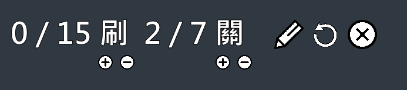
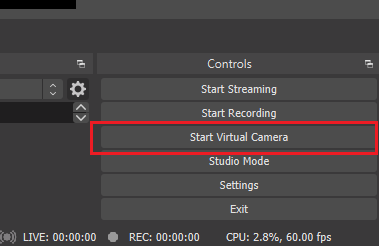

# Mario321Helper

## 簡介

瑪利歐創造家中挑戰模式可以進行挑戰玩家關卡，透過這個工具，可以自動算總共刷掉(跳過)了幾關和通過了幾關，方便用於實況相關內容的顯示工具。



過關  


刷掉  


### 功能

- 計算刷數、過關數
- 鉛筆符號：顯示或不顯示編輯用按鈕
- 關跟刷下面的加減號：如果有意外，可以手動編輯數字
- 重置符號：將刷和關歸零
- 關閉符號：關閉程式運行，退出程式

### 實際影片 demo

完整使用流程 : [Youtube](https://youtu.be/i5IZRKTCKFg)  
連續刷關 : [Youtube](https://youtu.be/y3l30vLKpMc)

## 安裝

- 自行用 pyinstaller 打包
  或
- 下載我打包好的 exe, 放在 [onedrive 空間](https://1drv.ms/u/s!AnNN4hXDvIX6gcR4reUh3FYsLLceMQ?e=3AyQqU)，下載後解壓縮(7z)

1. 預設設置是使用 OBS 的 Virtual Camera，先到 OBS 設置好你的遊戲場景
2. 點擊右下角的 Start Virtual Camera(相當於用一個虛擬鏡頭在照著這個 Scene ，給程式讀取用的)  
   
3. 解壓縮後點擊資料夾裡的 main.exe，運行時間依電腦設備可能啟動時間會有差異(要稍微等一下，初次可能慢一點，一般啟動約要 1 分鐘 - 2 分鐘)
4. 看到視窗出來了就是正確運行了
5. 程式是使用換關的關卡編號來偵測刷數，放置的時候不要遮擋到關卡刷數的位置。

## 圖片素材來源

[maan-icons](https://www.flaticon.com/authors/maan-icons)  
[Freepik](https://www.flaticon.com/authors/freepik)

# For Development

## Setup environment

可以透過 requirements.txt 安裝需要的 python 套件

```bash
pip install -r requirements.txt
```